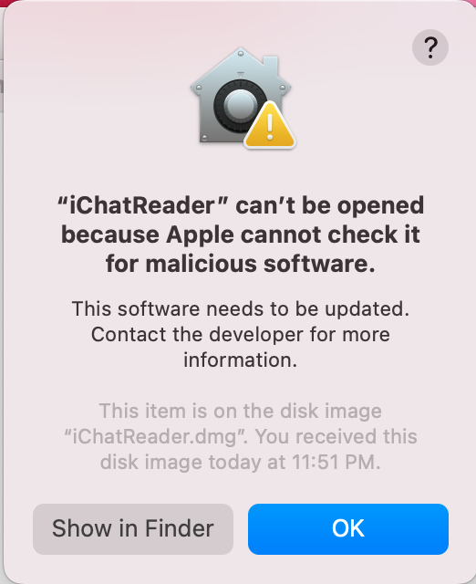
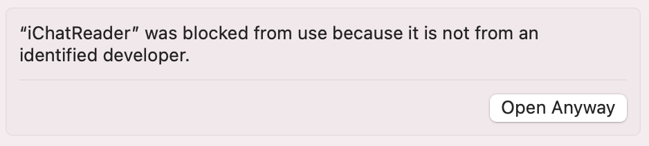

# iChatReader
A macOS app to read old iChat message logs. Very basic for now, but more to
come.

## Installing

Download the installer image containing the pre-built Universal Binary from the
release page. Mount the installer disk and copy the iChatReader app into
`Applications`.

If you encounter a security warning about that iChatReader "can't be opened
because Apple cannot check it for malicious software", you will need to manage
security settings in the Settings app.

In the Settings app, go to `Settings > Privacy & Security` and click on the
"Open Anyway" button to un-quarantine the app.

